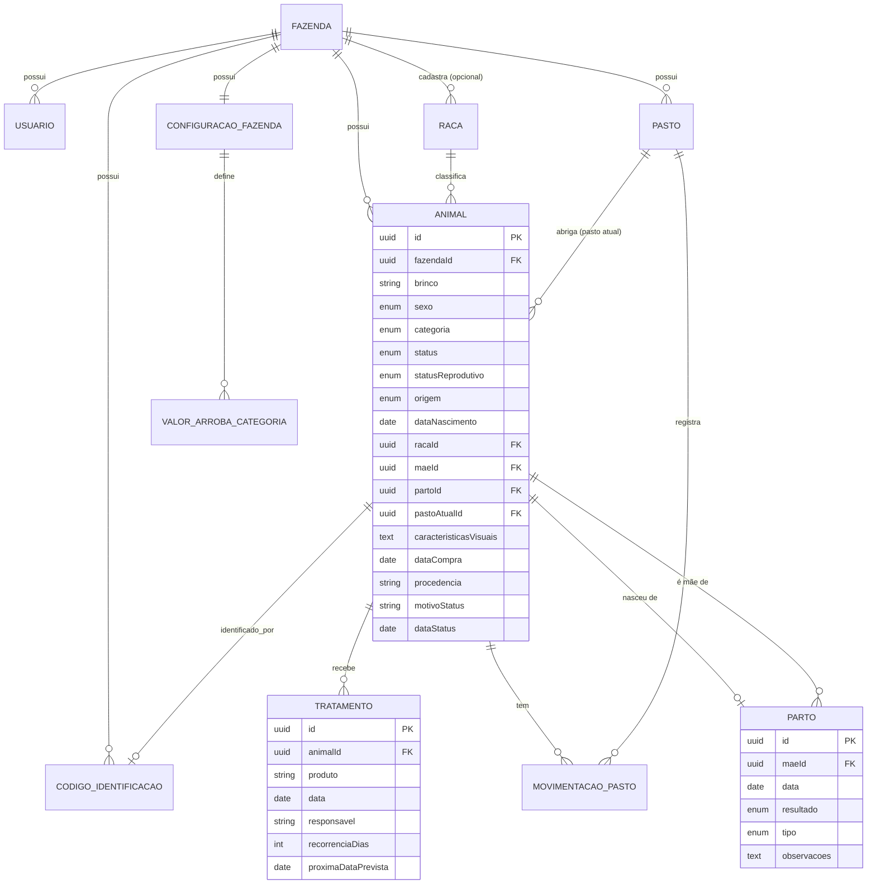

# Controle Fazenda — Modelagem do Sistema

> Este documento detalha a modelagem de dados e de classes a partir do `enunciado-controle-fazenda.md`. Ele substitui a seção 9 (preliminar) do enunciado.

## 1. Como pensar a modelagem (para quem vem de Java)

Em Java/Spring, você provavelmente está acostumado com `@Entity`, JPA e um objeto que representa tanto a tabela do banco quanto o objeto de negócio. No mundo Node/TypeScript com NestJS, costuma-se separar em **três tipos de objeto** diferentes, cada um com uma responsabilidade:

| Tipo | Equivalente em Java | Para que serve |
|---|---|---|
| **Entity** | Classe `@Entity` do JPA | Representa a tabela no banco. Tem decorators do ORM (Prisma ou TypeORM). É usada pelo `repository`. |
| **DTO** (Data Transfer Object) | Classe de request/response do Spring (`@RequestBody`) | Representa o formato de entrada/saída da API (o que chega e o que sai do `controller`). Tem validação (`class-validator`). |
| **Domain/Interface** | Interface ou classe de domínio | Representa o conceito de negócio em si, usado pelo `service`. Em projetos simples, às vezes a Entity já cumpre esse papel. |

Para o nosso projeto, vamos manter simples: a **Entity** (com decorators do ORM) também funciona como o modelo de domínio, e criamos **DTOs** separados só para entrada/saída da API. Isso é comum em projetos de porte pequeno/médio como o nosso.

**A arquitetura em camadas continua a mesma que você já conhece:**

```
Controller  → recebe a requisição HTTP, valida o DTO, chama o Service
Service     → regra de negócio (ex.: calcular intervalo entre partos)
Repository  → acesso ao banco (via Prisma/TypeORM)
Entity      → representa a tabela
```

## 2. Regra transversal: multi-tenant (isolamento por fazenda)

Quase toda entidade de negócio tem uma coluna `fazendaId`. Isso implementa a regra "os dados de uma fazenda nunca são visíveis para outra" (seção 6 do enunciado). Na prática:

- Toda consulta ao banco filtra por `fazendaId` (normalmente feito automaticamente no `service`, a partir do usuário logado no token JWT).
- É o mesmo princípio de um sistema multiempresa: `Usuario` pertence a uma `Fazenda`, e tudo que o usuário vê é escopado por ela.

## 3. Diagrama de entidades (Versão 1 — MVP)



> O diagrama cobre a Versão 1. As entidades de Pesagem, Suplementação, Cobertura e Venda (Versões 2 a 4) estão descritas na seção 7, sem o detalhamento total, já que ainda não serão implementadas.

## 4. Entidades da Versão 1 (detalhado)

### 4.1 `Fazenda`

A raiz do isolamento multi-tenant.

| Campo | Tipo | Observações |
|---|---|---|
| `id` | UUID (PK) | |
| `nome` | string | |
| `criadoEm` | datetime | |

### 4.2 `Usuario`

| Campo | Tipo | Observações |
|---|---|---|
| `id` | UUID (PK) | |
| `fazendaId` | UUID (FK → Fazenda) | |
| `nome` | string | |
| `email` | string | único |
| `senhaHash` | string | nunca armazenar senha em texto puro |
| `papel` | enum `DONO` \| `FUNCIONARIO` | define permissões |
| `criadoEm` | datetime | |

### 4.3 `Pasto`

| Campo | Tipo | Observações |
|---|---|---|
| `id` | UUID (PK) | |
| `fazendaId` | UUID (FK) | |
| `nome` | string | ex.: "Pasto 1" |

### 4.4 `Raca`

Catálogo de raças, compartilhado entre fazendas (registros do sistema) e ampliável por cada uma (registros próprios).

| Campo | Tipo | Observações |
|---|---|---|
| `id` | UUID (PK) | |
| `fazendaId` | UUID (FK, **nullable**) | `null` = raça padrão do sistema; preenchido = raça customizada/cruzamento adicionado por uma fazenda |
| `nome` | string | ex.: "Nelore", "Nelore x Simental" |
| `gestacaoMediaDias` | int | usado na previsão de parto (Versão 3) |

### 4.5 `Animal`

A entidade central do sistema — **única para bezerro, novilha, matriz e touro** (ver seção 5 abaixo, sobre por que não são tabelas separadas).

| Campo | Tipo | Observações |
|---|---|---|
| `id` | UUID (PK) | |
| `fazendaId` | UUID (FK) | |
| `brinco` | string | único **dentro da fazenda** (constraint composta `fazendaId + brinco`) |
| `sexo` | enum `M` \| `F` | |
| `categoria` | enum `BEZERRO` \| `NOVILHA` \| `MATRIZ` \| `TOURO` | alterada manualmente pelo produtor |
| `status` | enum `ATIVO` \| `VENDIDO` \| `MORTO` \| `DESCARTADO` | situação de vida/comercial do animal; nunca é excluído, só muda de status |
| `statusReprodutivo` | enum `PRENHE` \| `LACTANTE` \| `VAZIA` (nullable) | só se aplica a fêmeas (matriz/novilha); independente do `status` acima — uma matriz `ATIVA` pode estar `PRENHE`, `LACTANTE` ou `VAZIA` |
| `origem` | enum `NASCIDO_FAZENDA` \| `COMPRADO` | define se `maeId`/`partoId` são obrigatórios |
| `dataNascimento` | date | aproximada, quando não há parto registrado |
| `racaId` | UUID (FK → Raca, nullable) | |
| `maeId` | UUID (FK → Animal, nullable, auto-relacionamento) | obrigatório se `origem = NASCIDO_FAZENDA` |
| `paiId` | UUID (FK → Animal, nullable) | opcional (ver seção 5.2, genealogia — Versão 3) |
| `partoId` | UUID (FK → Parto, nullable) | |
| `pastoAtualId` | UUID (FK → Pasto, nullable) | |
| `caracteristicasVisuais` | text (nullable) | pelagem, marcas — ajuda a identificar o animal se o brinco se perder |
| `dataCompra` | date (nullable) | quando `origem = COMPRADO` |
| `procedencia` | string (nullable) | fazenda/vendedor de origem, se `COMPRADO` |
| `motivoStatus` | string (nullable) | causa: natimorto, pneumonia, acidente, idade, venda... |
| `dataStatus` | date (nullable) | data da mudança para morto/vendido/descartado |

### 4.6 `Parto`

| Campo | Tipo | Observações |
|---|---|---|
| `id` | UUID (PK) | |
| `maeId` | UUID (FK → Animal) | |
| `data` | date | |
| `resultado` | enum `VIVO` \| `NATIMORTO` | se `NATIMORTO`, não gera `Animal` filho |
| `tipo` | enum `NORMAL` \| `ASSISTIDO` | |
| `observacoes` | text (nullable) | |

Um `Parto` pode ter **zero ou mais** `Animal` filhos (gêmeos = dois; natimorto = zero).

### 4.7 `Tratamento`

| Campo | Tipo | Observações |
|---|---|---|
| `id` | UUID (PK) | |
| `animalId` | UUID (FK → Animal) | |
| `produto` | string | |
| `data` | date | |
| `responsavel` | string | |
| `recorrenciaDias` | int (nullable) | ex.: 90 |
| `proximaDataPrevista` | date (nullable, **calculado**) | `data + recorrenciaDias`, recalculado a cada nova aplicação |

### 4.8 `MovimentacaoPasto`

| Campo | Tipo | Observações |
|---|---|---|
| `id` | UUID (PK) | |
| `animalId` | UUID (FK → Animal) | |
| `pastoId` | UUID (FK → Pasto) | |
| `dataEntrada` | date | |
| `dataSaida` | date (nullable) | `null` = animal ainda está nesse pasto |

Quando um animal muda de pasto: fecha a movimentação atual (`dataSaida = hoje`) e cria uma nova. O `pastoAtualId` em `Animal` é um atalho para não precisar consultar o histórico toda vez.

### 4.9 `CodigoIdentificacao` (QR code)

| Campo | Tipo | Observações |
|---|---|---|
| `id` | UUID (PK) | |
| `fazendaId` | UUID (FK) | |
| `codigo` | string | valor único usado na URL (`/f/{fazendaId}/animal/{codigo}`) |
| `status` | enum `DISPONIVEL` \| `VINCULADO` \| `DESATIVADO` | |
| `animalId` | UUID (FK → Animal, nullable) | preenchido quando `status = VINCULADO` |
| `geradoEm` | datetime | |
| `vinculadoEm` | datetime (nullable) | |

Ao **reemitir** um código para um animal que perdeu o brinco: cria-se um novo `CodigoIdentificacao` (`VINCULADO`, apontando pro mesmo `animalId`), e o código antigo passa para `DESATIVADO`. Nunca se exclui ou reaproveita um código.

### 4.10 `ConfiguracaoFazenda` e `ValorArrobaCategoria`

| `ConfiguracaoFazenda` | Tipo | Observações |
|---|---|---|
| `id` | UUID (PK) | |
| `fazendaId` | UUID (FK, único) | relação 1—1 com Fazenda |
| `notificacoesAtivas` | boolean | |
| `somAtivo` | boolean | |

| `ValorArrobaCategoria` | Tipo | Observações |
|---|---|---|
| `id` | UUID (PK) | |
| `configuracaoFazendaId` | UUID (FK) | |
| `categoria` | enum (mesma de `Animal.categoria`) | |
| `pesoReferenciaKg` | decimal | ex.: 15 para adulto, 12–13 para jovem |

## 5. Decisões de modelagem explicadas

### 5.1 Por que `Animal` é uma entidade única (não `Bezerro`, `Matriz`, `Touro` separados)

Porque o **mesmo registro** muda de categoria ao longo da vida — um bezerro vira novilha, depois matriz. Se fossem tabelas diferentes, seria preciso copiar o registro de uma tabela para outra a cada mudança, perdendo o vínculo com o histórico (mãe, tratamentos, partos que ele já gerou). Com uma entidade única, `categoria` é só um campo que muda; o `id` e o histórico continuam os mesmos.

### 5.2 Por que `paiId` é opcional, mas `maeId` também

`maeId` é obrigatório apenas quando `origem = NASCIDO_FAZENDA` — um animal comprado não tem mãe conhecida. `paiId` é sempre opcional, porque, em monta natural com mais de um touro no mesmo pasto, não há como saber com certeza qual touro fecundou a matriz (só é confiável com um touro por lote, ou inseminação artificial — Versão 3).

### 5.3 Por que `Parto` e `Tratamento` são entidades, e não colunas do `Animal`

Ambos são **eventos que se repetem** ao longo da vida do animal (uma matriz tem vários partos; um animal recebe vários tratamentos), cada um com sua própria data e atributos. Uma coluna no `Animal` só guardaria o último registro, perdendo o histórico — e o histórico é justamente o que o enunciado pede (seção 5, item 8).

### 5.4 Por que `CodigoIdentificacao` é separado de `Animal`

Porque o QR code pode existir **antes** do animal ser cadastrado (geração em lote). Se fosse um campo do `Animal`, não teria onde morar até o cadastro acontecer. Como entidade própria, o código nasce com `status = DISPONIVEL` e `animalId = null`, e só se vincula depois.

### 5.5 Por que `status` e `statusReprodutivo` são campos separados

O enunciado original (seção 5, item 2) listava "prenhe, lactante, vazia, descartada" como um único `status` de matriz. Na modelagem, isso precisa virar **dois campos independentes**, porque são coisas que mudam em momentos diferentes e por motivos diferentes:

- `status` — situação de vida/comercial (ativo, vendido, morto, descartado). Muda raramente, e quando muda para `MORTO`/`VENDIDO`/`DESCARTADO` é definitivo.
- `statusReprodutivo` — fase do ciclo reprodutivo (prenhe, lactante, vazia). Só se aplica enquanto o animal está `ATIVO`, muda várias vezes ao longo da vida da matriz, e só faz sentido para fêmeas em categoria `MATRIZ` ou `NOVILHA`.

"Descartada" ficou só no `status` de vida, porque uma matriz descartada deixa de ser acompanhada reprodutivamente, independente de estar prenhe ou vazia no momento do descarte.

## 6. Exemplo de classes TypeScript (Entities)

Usando decorators no estilo TypeORM (bem parecido com JPA/Hibernate, o que deve ajudar na transição):

```ts
@Entity()
export class Animal {
  @PrimaryGeneratedColumn('uuid')
  id: string;

  @Column()
  fazendaId: string;

  @Column()
  brinco: string;

  @Column({ type: 'enum', enum: Sexo })
  sexo: Sexo;

  @Column({ type: 'enum', enum: CategoriaAnimal })
  categoria: CategoriaAnimal;

  @Column({ type: 'enum', enum: StatusAnimal, default: StatusAnimal.ATIVO })
  status: StatusAnimal;

  @Column({ type: 'enum', enum: StatusReprodutivo, nullable: true })
  statusReprodutivo?: StatusReprodutivo;

  @Column({ type: 'enum', enum: OrigemAnimal })
  origem: OrigemAnimal;

  @Column({ type: 'date' })
  dataNascimento: Date;

  @ManyToOne(() => Raca, { nullable: true })
  raca?: Raca;

  @ManyToOne(() => Animal, { nullable: true })
  mae?: Animal;

  @ManyToOne(() => Animal, { nullable: true })
  pai?: Animal;

  @OneToOne(() => Parto, { nullable: true })
  parto?: Parto;

  @ManyToOne(() => Pasto, { nullable: true })
  pastoAtual?: Pasto;

  @Column({ type: 'text', nullable: true })
  caracteristicasVisuais?: string;

  @Column({ type: 'date', nullable: true })
  dataCompra?: Date;

  @Column({ nullable: true })
  procedencia?: string;

  @Column({ nullable: true })
  motivoStatus?: string;

  @Column({ type: 'date', nullable: true })
  dataStatus?: Date;

  @OneToMany(() => Tratamento, (t) => t.animal)
  tratamentos: Tratamento[];
}

export enum Sexo { M = 'M', F = 'F' }
export enum CategoriaAnimal { BEZERRO = 'BEZERRO', NOVILHA = 'NOVILHA', MATRIZ = 'MATRIZ', TOURO = 'TOURO' }
export enum StatusAnimal { ATIVO = 'ATIVO', VENDIDO = 'VENDIDO', MORTO = 'MORTO', DESCARTADO = 'DESCARTADO' }
export enum StatusReprodutivo { PRENHE = 'PRENHE', LACTANTE = 'LACTANTE', VAZIA = 'VAZIA' }
export enum OrigemAnimal { NASCIDO_FAZENDA = 'NASCIDO_FAZENDA', COMPRADO = 'COMPRADO' }
```

```ts
@Entity()
export class Parto {
  @PrimaryGeneratedColumn('uuid')
  id: string;

  @ManyToOne(() => Animal)
  mae: Animal;

  @Column({ type: 'date' })
  data: Date;

  @Column({ type: 'enum', enum: ResultadoParto })
  resultado: ResultadoParto;

  @Column({ type: 'enum', enum: TipoParto })
  tipo: TipoParto;

  @Column({ type: 'text', nullable: true })
  observacoes?: string;

  @OneToMany(() => Animal, (a) => a.parto)
  crias: Animal[];
}

export enum ResultadoParto { VIVO = 'VIVO', NATIMORTO = 'NATIMORTO' }
export enum TipoParto { NORMAL = 'NORMAL', ASSISTIDO = 'ASSISTIDO' }
```

## 7. Prévia das entidades futuras (Versões 2 a 4)

Sem detalhamento total — só para você já visualizar como a Versão 1 dá base para elas.

| Entidade | Versão | Resumo |
|---|---|---|
| `Pesagem` | 2 | `animalId`, `data`, `pesoKg` — base para GMD |
| `Desmame` | 2 | `animalId`, `data`, `pesoKg`, `pastoNovoId` |
| `Suplementacao` | 2 | período de silagem por pasto/grupo |
| `Cobertura` | 3 | `matrizId`, `touroId` (nullable), `data`, `tipo` (monta natural/IA), `dataPrevistaParto` |
| `Venda` / `Compra` | 4 | `animalId`, `data`, `pesoKg`, `valorArroba`, `valorTotal` |

## 8. Próximos passos

1. Configurar o ambiente (Node, TypeScript, NestJS CLI, Docker, Postgres).
2. Criar o projeto NestJS e configurar o ORM (Prisma ou TypeORM) com as entidades da Versão 1.
3. Implementar as entidades como migrations do banco.
4. Implementar os módulos na ordem: `Fazenda`/`Usuario` (autenticação) → `Pasto` → `Raca` → `Animal` → `Parto` → `Tratamento` → `CodigoIdentificacao`.
